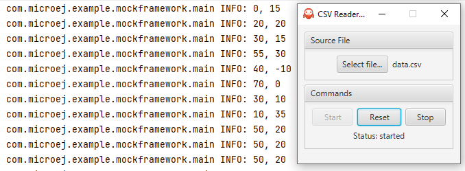

# Overview

The File Chooser Mock example shows the use of file chooser widget and the reading of a CSV file using the Mock Framework.

The example implements a file chooser widget, buttons to start/reset/stop the value reading and a file reading status label.

This module contains the application part of the example.

# Requirements

* [MICROEJ SDK 6](https://docs.microej.com/en/latest/SDK6UserGuide/index.html).
* A [VEE Port](https://github.com/MicroEJ/?q=VEEPort&type=all&language=&sort=) that contains:
    * EDC-1.3 or higher.

This example has been tested on:

* Android Studio with MicroEJ plugin for Android Studio 0.1.2.
* [STM32F7508-DK VEE Port 2.2.0](https://github.com/MicroEJ/VEEPort-STMicroelectronics-STM32F7508-DK/tree/2.2.0).

# Usage

Open the Example-Mock-Framework project in Android Studio.

Make sure to properly setup the VEE Port.

By default, the sample will use the STM32F7508-DK VEE Port.

## Run the example on Simulator

In Android Studio:
- Open the Gradle tool window by clicking on the elephant icon on the right side,
- Expand the `file-chooser-app` > `Tasks` > `microej` lists,
- Double-click on `runOnSimulator`,
- The application starts, the traces are visible in the Run view.

Alternative ways to run in simulation are described in the [Run on Simulator](https://docs.microej.com/en/latest/SDK6UserGuide/runOnSimulator.html) documentation.

## Play with the example

* Select a file with the `Select file...` button. An example file is available in the `src/main/resources` folder.
* Click on the `Start` button. The application will start reading the data provided by the CSV file and logging it to the console.
* Click on the `Reset` button to start reading from the beginning of the file.
* Click on the `Stop` button to stop reading the data.

# Dependencies

_All dependencies are retrieved transitively by Gradle_.

# Source

N/A.

# Restrictions

None.

---
_Markdown_   
_Copyright 2024 MicroEJ Corp. All rights reserved._  
_Use of this source code is governed by a BSD-style license that can be found with this software._